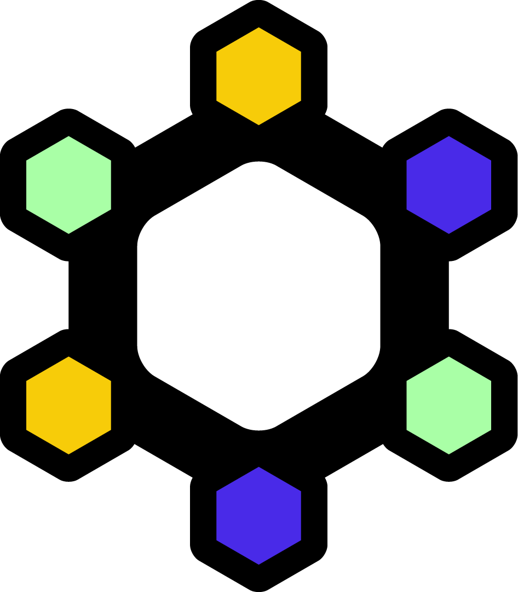
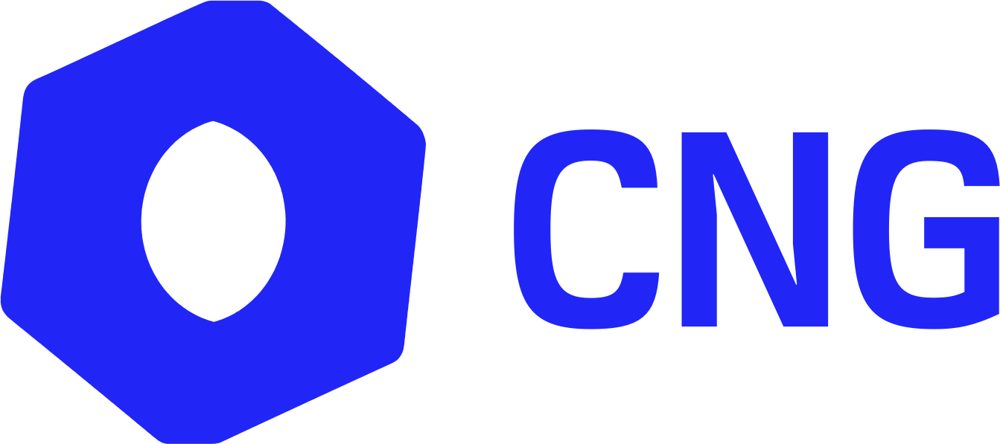

```{=html}
<div class="logo-float" aria-hidden="true">
  <svg width="0" height="0" style="position:absolute">
    <filter id="logo-knockout" color-interpolation-filters="sRGB">
      <feColorMatrix type="matrix" values="0 0 0 0 1  0 0 0 0 1  0 0 0 0 1  -0.2126 -0.7152 -0.0722 0 1" result="ink"/>
      <feComposite in="ink" in2="SourceAlpha" operator="in"/>
    </filter>
  </svg>
  <div class="logo-float-item" style="left:105px; top:85px; --dur:10.3s; --delay:-3.6s; --rot:-4.7deg"></div>
  <div class="logo-float-item" style="left:304px; top:114px; --dur:8.2s; --delay:-6.5s; --rot:-4.2deg"></div>
  <div class="logo-float-item" style="left:502px; top:71px; --dur:10.1s; --delay:-1.3s; --rot:-4.1deg"></div>
  <div class="logo-float-item is-badge" style="left:701px; top:111px; --dur:10.0s; --delay:-6.2s; --rot:4.5deg"></div>
  <div class="logo-float-item" style="left:899px; top:111px; --dur:11.3s; --delay:-10.7s; --rot:-2.7deg"></div>
  <div class="logo-float-item" style="left:1098px; top:87px; --dur:10.4s; --delay:-7.8s; --rot:4.8deg"></div>
  <div class="logo-float-item" style="left:1296px; top:85px; --dur:10.7s; --delay:-5.5s; --rot:-2.9deg"></div>
  <div class="logo-float-item" style="left:1495px; top:80px; --dur:11.8s; --delay:-5.0s; --rot:3.4deg"></div>
  <div class="logo-float-item" style="left:105px; top:278px; --dur:7.1s; --delay:-5.2s; --rot:-2.8deg"></div>
  <div class="logo-float-item" style="left:304px; top:266px; --dur:11.4s; --delay:-10.0s; --rot:2.6deg"></div>
  <div class="logo-float-item" style="left:502px; top:280px; --dur:7.3s; --delay:-7.8s; --rot:-3.9deg"></div>
  <div class="logo-float-item" style="left:701px; top:276px; --dur:8.4s; --delay:-7.6s; --rot:2.1deg"></div>
  <div class="logo-float-item" style="left:899px; top:255px; --dur:9.5s; --delay:-0.7s; --rot:-4.3deg"></div>
  <div class="logo-float-item" style="left:1098px; top:259px; --dur:9.3s; --delay:-6.0s; --rot:5.0deg"></div>
  <div class="logo-float-item" style="left:1296px; top:281px; --dur:10.7s; --delay:-3.7s; --rot:4.2deg"></div>
  <div class="logo-float-item" style="left:1495px; top:274px; --dur:11.1s; --delay:-11.2s; --rot:-4.6deg"></div>
  <div class="logo-float-item" style="left:105px; top:448px; --dur:11.7s; --delay:-6.2s; --rot:4.6deg"></div>
  <div class="logo-float-item" style="left:337px; top:460px; --dur:10.4s; --delay:-4.0s; --rot:2.6deg"></div>
  <div class="logo-float-item" style="left:568px; top:429px; --dur:10.3s; --delay:-6.3s; --rot:-3.2deg"></div>
  <div class="logo-float-item" style="left:800px; top:429px; --dur:9.2s; --delay:-5.5s; --rot:-4.2deg"></div>
  <div class="logo-float-item" style="left:1032px; top:438px; --dur:11.9s; --delay:-4.7s; --rot:-4.9deg"></div>
  <div class="logo-float-item" style="left:1263px; top:461px; --dur:7.5s; --delay:-7.2s; --rot:-2.3deg"></div>
  <div class="logo-float-item" style="left:1495px; top:426px; --dur:10.4s; --delay:-7.4s; --rot:-2.7deg"></div>
  <div class="logo-float-item" style="left:165px; top:620px; --dur:9.0s; --delay:-2.7s; --rot:-4.2deg"></div>
  <div class="logo-float-item" style="left:363px; top:617px; --dur:8.7s; --delay:-11.1s; --rot:2.7deg"></div>
  <div class="logo-float-item" style="left:580px; top:607px; --dur:11.2s; --delay:-5.3s; --rot:-4.9deg"></div>
  <div class="logo-float-item" style="left:749px; top:624px; --dur:8.4s; --delay:-4.2s; --rot:-4.9deg"></div>
  <div class="logo-float-item" style="left:952px; top:605px; --dur:8.1s; --delay:-3.7s; --rot:2.7deg"></div>
  <div class="logo-float-item is-badge" style="left:1144px; top:611px; --dur:9.7s; --delay:-1.9s; --rot:2.6deg"></div>
  <div class="logo-float-item" style="left:1319px; top:643px; --dur:9.2s; --delay:-0.8s; --rot:-4.0deg"></div>
  <div class="logo-float-item" style="left:1495px; top:648px; --dur:11.7s; --delay:-3.3s; --rot:3.5deg"></div>
  <div class="logo-float-item" style="left:105px; top:808px; --dur:11.0s; --delay:-1.7s; --rot:-2.5deg"></div>
  <div class="logo-float-item" style="left:285px; top:825px; --dur:9.4s; --delay:-7.2s; --rot:3.0deg"></div>
  <div class="logo-float-item" style="left:465px; top:788px; --dur:11.7s; --delay:-0.3s; --rot:-2.2deg"></div>
  <div class="logo-float-item is-wide" style="left:690px; top:787px; --dur:7.2s; --delay:-9.8s; --rot:4.1deg"></div>
  <div class="logo-float-item" style="left:905px; top:802px; --dur:11.7s; --delay:-1.4s; --rot:-3.8deg"></div>
  <div class="logo-float-item" style="left:1085px; top:793px; --dur:10.2s; --delay:-5.9s; --rot:2.8deg"></div>
  <div class="logo-float-item is-knockout" style="left:1245px; top:835px; --dur:10.9s; --delay:-2.5s; --rot:3.8deg"></div>
  <div class="logo-float-item" style="left:1400px; top:804px; --dur:7.1s; --delay:-6.5s; --rot:-4.4deg"></div>
</div>
```
