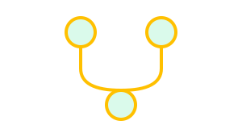
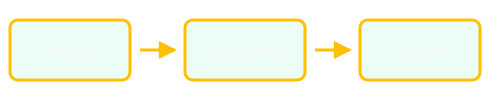
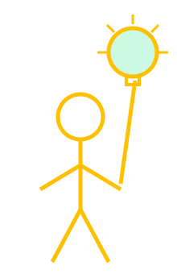
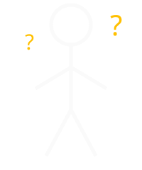
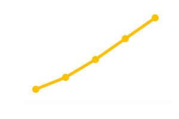

## {#slide-01 background-image="images/pexels-matthew-montrone-230847-2395812.jpg" background-size="cover" background-position="center"}

::: {.deep-shade}
:::

::: {.center-v .deep-copy}
[Earth Genome]{.statement-sub .a-fade style="--d:0.3s"}

[From uploads]{.statement .a-rise style="--d:2s"}

[to impact]{.statement .a-rise style="--d:4.5s"}

[with a CNG default]{.statement .hl .a-rise style="--d:7s"}
:::


## {#slide-02}

In cloud-native geospatial we often talk about **large-scale—even global—datasets**.

Practitioners on the front lines of **climate change and conservation** usually work **more locally**, with data they **already own**.


## {#slide-03}

::: {.center-v}
### Discovery often starts here

**Reference layers** teams upload—not a brand-new global feed.
:::


## {#slide-04}

::: {.center-v}
{fig-alt="Simple workflow diagram" width=420}

### User-uploaded reference layers

A real feature in a product practitioners use every day.
:::


## {#slide-05}

::: {.center-v}
{fig-alt="Fork in the road" width=360}

### Why **PMTiles** was our default

Portable tiles, HTTP range reads, fits the cloud-native stack we already trust.
:::


## {#slide-06}

::: {.center-v}
### What we chose *not* to build first

A heavier **traditional upload → tile → serve** architecture.
:::


## {#slide-07}

::: {.center-v}
{fig-alt="Cloud Native Geospatial Forum logo" width=440}

### Cloud-native **standards** over custom plumbing

Ecosystem defaults turned a harder engineering path into a **simple, high-value** ship.
:::


## {#slide-08}

::: {.center-v}
::: {.formula}
[Less time on plumbing]{.highlight}  ·  [More time on impact]{.highlight}
:::
:::


## {#slide-09}

::: {.center-v}
{fig-alt="A slide with an arrow pointing to a circle containing the number 1"}

### One slide · one idea · 15 seconds

*(Seven minutes on stage—keep the pacing tight.)*
:::


## {#slide-10}

::: {.center-v}
{fig-alt="Upload to map flow" width=480}

### Upload → store → discover on the map

*(Add product screenshots or a short GIF here.)*
:::


## {#slide-11}

### PMTiles in one sentence

A **single file** of vector tiles, read with **HTTP range requests**—no tile server required for the happy path.


## {#slide-12}

::: {.center-v}
{fig-alt="Layered landscape" width=520}

### Smaller scope, same pattern

Local reference layers teach the same cloud-native habits as global delivery—at a scale teams feel immediately.
:::


## {#slide-13}

::: {.center-v}
### Stand on ecosystem defaults

**PMTiles · object storage · clients that already speak the spec**

Reuse before you invent.
:::


## {#slide-14}

::: {.center-v}
{fig-alt="Stick figure pointing up at a glowing lightbulb"}

### Better discovery → better decisions on the ground
:::


## {#slide-15}


::: {.center-v}
{fig-alt="Stick figure surrounded by question marks"}

### **The problem**

Teams already have critical context in **local layers**—but it is hard to **find and use** next to everything else in the platform.
:::


## {#slide-16}

::: {.center-v}
{fig-alt="Glowing lightbulb"}

### **The big idea**

Treat **PMTiles** as the default upload format and skip the heavy custom tiling pipeline.
:::


## {#slide-17}

::: {.center-v}
{fig-alt="Browser window with placeholder text lines"}

### **Live demo**

Walk through **uploading a reference layer** and seeing it in discovery workflows.
:::


## {#slide-18}

::: {.center-v}
{fig-alt="Line chart trending upward"}

### **Results**

**Faster delivery**, less ops surface area, and practitioners spending time on **impact**—not plumbing.
:::


## {#slide-19}

**Links**

[earthgenome.org](https://earthgenome.org)

[PMTiles](https://docs.protomaps.com/pmtiles/)

[cloudnativegeo.org](https://cloudnativegeo.org)


## {#slide-20}

```{=html}
<canvas class="grow-network"></canvas>
<div class="closing-copy">
  <p class="statement a-rise" style="--d:7s">Less plumbing. More impact.</p>
  <p class="statement-sub hl a-rise" style="--d:9.5s">Brad Andrick · Earth Genome</p>
</div>
```


## {#slide-applause data-autoslide="0" data-state="no-bars"}

```{=html}
<div class="center-v">
<svg class="clappers" viewBox="0 0 1500 520" aria-label="A crowd of stick figures clapping, with the occasional high-five">
  <g stroke-width="6" stroke-linecap="round" stroke-linejoin="round" fill="none">
    <!-- Back row first so nearer figures draw on top; forearms swing about the elbow -->
    <g class="drift" style="--dx:3.1px; --dy:0.1px; --dp:3.48s; --dd:-2.38s">
    <svg class="clapper" x="75" y="-6" width="140" height="210" viewBox="0 0 200 300" style="--d:0.27s; --t:0.27s" stroke="#8B929B">
      <line x1="100" y1="88" x2="100" y2="190"/>
      <polyline points="65,270 100,190 135,270"/>
      <g class="side side-l"><line x1="100" y1="105" x2="50" y2="160"/><line class="forearm forearm-l" style="transform-origin:50px 160px" x1="50" y1="160" x2="96" y2="140"/></g>
      <g class="side side-r"><line x1="100" y1="105" x2="150" y2="160"/><line class="forearm forearm-r" style="transform-origin:150px 160px" x1="150" y1="160" x2="104" y2="140"/></g>
      <circle cx="100" cy="60" r="28" fill="#1D232B"/>
      <g class="spark" stroke="#FFD626" stroke-width="4">
        <line x1="90" y1="132" x2="81" y2="132"/><line x1="110" y1="132" x2="119" y2="132"/>
      </g>
    </svg>
    </g>
    <g class="drift" style="--dx:2.0px; --dy:1.0px; --dp:3.08s; --dd:-2.33s">
    <svg class="clapper" x="267" y="1" width="140" height="210" viewBox="0 0 200 300" style="--d:0.55s; --t:0.26s" stroke="#8B929B">
      <line x1="100" y1="88" x2="100" y2="190"/>
      <polyline points="65,270 100,190 135,270"/>
      <g class="side side-l"><line x1="100" y1="105" x2="50" y2="160"/><line class="forearm forearm-l" style="transform-origin:50px 160px" x1="50" y1="160" x2="96" y2="140"/></g>
      <g class="side side-r"><line x1="100" y1="105" x2="150" y2="160"/><line class="forearm forearm-r" style="transform-origin:150px 160px" x1="150" y1="160" x2="104" y2="140"/></g>
      <circle cx="100" cy="60" r="28" fill="#1D232B"/>
      <g class="spark" stroke="#FFD626" stroke-width="4">
        <line x1="90" y1="132" x2="81" y2="132"/><line x1="110" y1="132" x2="119" y2="132"/>
      </g>
    </svg>
    </g>
    <g class="drift" style="--dx:2.9px; --dy:1.6px; --dp:4.16s; --dd:-0.57s">
    <g class="walker" style="--hf:4.37s; --hfd:1.55s; --w:56px">
    <svg class="clapper" x="467" y="0" width="140" height="210" viewBox="0 0 200 300" style="--d:0.30s; --t:0.27s" stroke="#8B929B">
      <line x1="100" y1="88" x2="100" y2="190"/>
      <polyline points="65,270 100,190 135,270"/>
      <g class="side side-l"><line x1="100" y1="105" x2="50" y2="160"/><line class="forearm forearm-l" style="transform-origin:50px 160px" x1="50" y1="160" x2="96" y2="140"/></g>
      <g class="side side-r hf-hide"><line x1="100" y1="105" x2="150" y2="160"/><line class="forearm forearm-r" style="transform-origin:150px 160px" x1="150" y1="160" x2="104" y2="140"/></g>
      <line class="hf-arm hf-arm-r" style="transform-origin:100px 105px" x1="100" y1="105" x2="190" y2="105"/>
      <circle cx="100" cy="60" r="28" fill="#1D232B"/>
      <g class="spark" stroke="#FFD626" stroke-width="4">
        <line x1="90" y1="132" x2="81" y2="132"/><line x1="110" y1="132" x2="119" y2="132"/>
      </g>
    </svg>
    </g>
    </g>
    <g class="drift" style="--dx:2.9px; --dy:1.6px; --dp:4.16s; --dd:-0.57s">
    <g class="walker" style="--hf:4.37s; --hfd:1.55s; --w:-56px">
    <svg class="clapper" x="678" y="-7" width="140" height="210" viewBox="0 0 200 300" style="--d:0.11s; --t:0.26s" stroke="#8B929B">
      <line x1="100" y1="88" x2="100" y2="190"/>
      <polyline points="65,270 100,190 135,270"/>
      <g class="side side-l hf-hide"><line x1="100" y1="105" x2="50" y2="160"/><line class="forearm forearm-l" style="transform-origin:50px 160px" x1="50" y1="160" x2="96" y2="140"/></g>
      <g class="side side-r"><line x1="100" y1="105" x2="150" y2="160"/><line class="forearm forearm-r" style="transform-origin:150px 160px" x1="150" y1="160" x2="104" y2="140"/></g>
      <line class="hf-arm hf-arm-l" style="transform-origin:100px 105px" x1="100" y1="105" x2="10" y2="105"/>
      <circle cx="100" cy="60" r="28" fill="#1D232B"/>
      <g class="spark" stroke="#FFD626" stroke-width="4">
        <line x1="90" y1="132" x2="81" y2="132"/><line x1="110" y1="132" x2="119" y2="132"/>
      </g>
    </svg>
    </g>
    </g>
    <g class="drift" style="--dx:2.4px; --dy:0.6px; --dp:4.85s; --dd:-1.95s">
    <svg class="clapper" x="878" y="5" width="140" height="210" viewBox="0 0 200 300" style="--d:0.38s; --t:0.30s" stroke="#8B929B">
      <line x1="100" y1="88" x2="100" y2="190"/>
      <polyline points="65,270 100,190 135,270"/>
      <g class="side side-l"><line x1="100" y1="105" x2="50" y2="160"/><line class="forearm forearm-l" style="transform-origin:50px 160px" x1="50" y1="160" x2="96" y2="140"/></g>
      <g class="side side-r"><line x1="100" y1="105" x2="150" y2="160"/><line class="forearm forearm-r" style="transform-origin:150px 160px" x1="150" y1="160" x2="104" y2="140"/></g>
      <circle cx="100" cy="60" r="28" fill="#1D232B"/>
      <g class="spark" stroke="#FFD626" stroke-width="4">
        <line x1="90" y1="132" x2="81" y2="132"/><line x1="110" y1="132" x2="119" y2="132"/>
      </g>
    </svg>
    </g>
    <g class="drift" style="--dx:1.2px; --dy:1.4px; --dp:3.41s; --dd:-3.26s">
    <svg class="clapper" x="1072" y="2" width="140" height="210" viewBox="0 0 200 300" style="--d:0.06s; --t:0.24s" stroke="#8B929B">
      <line x1="100" y1="88" x2="100" y2="190"/>
      <polyline points="65,270 100,190 135,270"/>
      <g class="side side-l"><line x1="100" y1="105" x2="50" y2="160"/><line class="forearm forearm-l" style="transform-origin:50px 160px" x1="50" y1="160" x2="96" y2="140"/></g>
      <g class="side side-r"><line x1="100" y1="105" x2="150" y2="160"/><line class="forearm forearm-r" style="transform-origin:150px 160px" x1="150" y1="160" x2="104" y2="140"/></g>
      <circle cx="100" cy="60" r="28" fill="#1D232B"/>
      <g class="spark" stroke="#FFD626" stroke-width="4">
        <line x1="90" y1="132" x2="81" y2="132"/><line x1="110" y1="132" x2="119" y2="132"/>
      </g>
    </svg>
    </g>
    <g class="drift" style="--dx:0.8px; --dy:1.3px; --dp:3.96s; --dd:-2.17s">
    <svg class="clapper" x="1282" y="-2" width="140" height="210" viewBox="0 0 200 300" style="--d:0.05s; --t:0.30s" stroke="#8B929B">
      <line x1="100" y1="88" x2="100" y2="190"/>
      <polyline points="65,270 100,190 135,270"/>
      <g class="side side-l"><line x1="100" y1="105" x2="50" y2="160"/><line class="forearm forearm-l" style="transform-origin:50px 160px" x1="50" y1="160" x2="96" y2="140"/></g>
      <g class="side side-r"><line x1="100" y1="105" x2="150" y2="160"/><line class="forearm forearm-r" style="transform-origin:150px 160px" x1="150" y1="160" x2="104" y2="140"/></g>
      <circle cx="100" cy="60" r="28" fill="#1D232B"/>
      <g class="spark" stroke="#FFD626" stroke-width="4">
        <line x1="90" y1="132" x2="81" y2="132"/><line x1="110" y1="132" x2="119" y2="132"/>
      </g>
    </svg>
    </g>
    <g class="drift" style="--dx:6.0px; --dy:-0.7px; --dp:3.39s; --dd:-0.69s">
    <svg class="clapper" x="114" y="101" width="170" height="255" viewBox="0 0 200 300" style="--d:0.42s; --t:0.21s" stroke="#BCC1C8">
      <line x1="100" y1="88" x2="100" y2="190"/>
      <polyline points="65,270 100,190 135,270"/>
      <g class="side side-l"><line x1="100" y1="105" x2="50" y2="160"/><line class="forearm forearm-l" style="transform-origin:50px 160px" x1="50" y1="160" x2="96" y2="140"/></g>
      <g class="side side-r"><line x1="100" y1="105" x2="150" y2="160"/><line class="forearm forearm-r" style="transform-origin:150px 160px" x1="150" y1="160" x2="104" y2="140"/></g>
      <circle cx="100" cy="60" r="28" fill="#1D232B"/>
      <g class="spark" stroke="#FFD626" stroke-width="4">
        <line x1="90" y1="132" x2="81" y2="132"/><line x1="110" y1="132" x2="119" y2="132"/>
      </g>
    </svg>
    </g>
    <g class="drift" style="--dx:3.5px; --dy:-2.3px; --dp:2.58s; --dd:-1.89s">
    <g class="walker" style="--hf:1.55s; --hfd:1.98s; --w:58px">
    <svg class="clapper" x="332" y="89" width="170" height="255" viewBox="0 0 200 300" style="--d:0.59s; --t:0.32s" stroke="#BCC1C8">
      <line x1="100" y1="88" x2="100" y2="190"/>
      <polyline points="65,270 100,190 135,270"/>
      <g class="side side-l"><line x1="100" y1="105" x2="50" y2="160"/><line class="forearm forearm-l" style="transform-origin:50px 160px" x1="50" y1="160" x2="96" y2="140"/></g>
      <g class="side side-r hf-hide"><line x1="100" y1="105" x2="150" y2="160"/><line class="forearm forearm-r" style="transform-origin:150px 160px" x1="150" y1="160" x2="104" y2="140"/></g>
      <line class="hf-arm hf-arm-r" style="transform-origin:100px 105px" x1="100" y1="105" x2="190" y2="105"/>
      <circle cx="100" cy="60" r="28" fill="#1D232B"/>
      <g class="spark" stroke="#FFD626" stroke-width="4">
        <line x1="90" y1="132" x2="81" y2="132"/><line x1="110" y1="132" x2="119" y2="132"/>
      </g>
    </svg>
    </g>
    </g>
    <g class="drift" style="--dx:3.5px; --dy:-2.3px; --dp:2.58s; --dd:-1.89s">
    <g class="walker" style="--hf:1.55s; --hfd:1.98s; --w:-58px">
    <svg class="clapper" x="567" y="90" width="170" height="255" viewBox="0 0 200 300" style="--d:0.39s; --t:0.27s" stroke="#BCC1C8">
      <line x1="100" y1="88" x2="100" y2="190"/>
      <polyline points="65,270 100,190 135,270"/>
      <g class="side side-l hf-hide"><line x1="100" y1="105" x2="50" y2="160"/><line class="forearm forearm-l" style="transform-origin:50px 160px" x1="50" y1="160" x2="96" y2="140"/></g>
      <g class="side side-r"><line x1="100" y1="105" x2="150" y2="160"/><line class="forearm forearm-r" style="transform-origin:150px 160px" x1="150" y1="160" x2="104" y2="140"/></g>
      <line class="hf-arm hf-arm-l" style="transform-origin:100px 105px" x1="100" y1="105" x2="10" y2="105"/>
      <circle cx="100" cy="60" r="28" fill="#1D232B"/>
      <g class="spark" stroke="#FFD626" stroke-width="4">
        <line x1="90" y1="132" x2="81" y2="132"/><line x1="110" y1="132" x2="119" y2="132"/>
      </g>
    </svg>
    </g>
    </g>
    <g class="drift" style="--dx:-0.5px; --dy:-1.6px; --dp:4.10s; --dd:-0.90s">
    <g class="walker" style="--hf:8.62s; --hfd:1.56s; --w:39px">
    <svg class="clapper" x="777" y="93" width="170" height="255" viewBox="0 0 200 300" style="--d:0.09s; --t:0.20s" stroke="#BCC1C8">
      <line x1="100" y1="88" x2="100" y2="190"/>
      <polyline points="65,270 100,190 135,270"/>
      <g class="side side-l"><line x1="100" y1="105" x2="50" y2="160"/><line class="forearm forearm-l" style="transform-origin:50px 160px" x1="50" y1="160" x2="96" y2="140"/></g>
      <g class="side side-r hf-hide"><line x1="100" y1="105" x2="150" y2="160"/><line class="forearm forearm-r" style="transform-origin:150px 160px" x1="150" y1="160" x2="104" y2="140"/></g>
      <line class="hf-arm hf-arm-r" style="transform-origin:100px 105px" x1="100" y1="105" x2="190" y2="105"/>
      <circle cx="100" cy="60" r="28" fill="#1D232B"/>
      <g class="spark" stroke="#FFD626" stroke-width="4">
        <line x1="90" y1="132" x2="81" y2="132"/><line x1="110" y1="132" x2="119" y2="132"/>
      </g>
    </svg>
    </g>
    </g>
    <g class="drift" style="--dx:-0.5px; --dy:-1.6px; --dp:4.10s; --dd:-0.90s">
    <g class="walker" style="--hf:8.62s; --hfd:1.56s; --w:-39px">
    <svg class="clapper" x="974" y="88" width="170" height="255" viewBox="0 0 200 300" style="--d:0.32s; --t:0.21s" stroke="#BCC1C8">
      <line x1="100" y1="88" x2="100" y2="190"/>
      <polyline points="65,270 100,190 135,270"/>
      <g class="side side-l hf-hide"><line x1="100" y1="105" x2="50" y2="160"/><line class="forearm forearm-l" style="transform-origin:50px 160px" x1="50" y1="160" x2="96" y2="140"/></g>
      <g class="side side-r"><line x1="100" y1="105" x2="150" y2="160"/><line class="forearm forearm-r" style="transform-origin:150px 160px" x1="150" y1="160" x2="104" y2="140"/></g>
      <line class="hf-arm hf-arm-l" style="transform-origin:100px 105px" x1="100" y1="105" x2="10" y2="105"/>
      <circle cx="100" cy="60" r="28" fill="#1D232B"/>
      <g class="spark" stroke="#FFD626" stroke-width="4">
        <line x1="90" y1="132" x2="81" y2="132"/><line x1="110" y1="132" x2="119" y2="132"/>
      </g>
    </svg>
    </g>
    </g>
    <g class="drift" style="--dx:-3.8px; --dy:-2.0px; --dp:4.90s; --dd:-4.79s">
    <svg class="clapper" x="1208" y="94" width="170" height="255" viewBox="0 0 200 300" style="--d:0.11s; --t:0.23s" stroke="#BCC1C8">
      <line x1="100" y1="88" x2="100" y2="190"/>
      <polyline points="65,270 100,190 135,270"/>
      <g class="side side-l"><line x1="100" y1="105" x2="50" y2="160"/><line class="forearm forearm-l" style="transform-origin:50px 160px" x1="50" y1="160" x2="96" y2="140"/></g>
      <g class="side side-r"><line x1="100" y1="105" x2="150" y2="160"/><line class="forearm forearm-r" style="transform-origin:150px 160px" x1="150" y1="160" x2="104" y2="140"/></g>
      <circle cx="100" cy="60" r="28" fill="#1D232B"/>
      <g class="spark" stroke="#FFD626" stroke-width="4">
        <line x1="90" y1="132" x2="81" y2="132"/><line x1="110" y1="132" x2="119" y2="132"/>
      </g>
    </svg>
    </g>
    <g class="drift" style="--dx:7.2px; --dy:-0.1px; --dp:3.27s; --dd:-0.58s">
    <g class="walker" style="--hf:7.54s; --hfd:1.83s; --w:58px">
    <svg class="clapper" x="153" y="199" width="200" height="300" viewBox="0 0 200 300" style="--d:0.02s; --t:0.26s" stroke="#F2F4F6">
      <line x1="100" y1="88" x2="100" y2="190"/>
      <polyline points="65,270 100,190 135,270"/>
      <g class="side side-l"><line x1="100" y1="105" x2="50" y2="160"/><line class="forearm forearm-l" style="transform-origin:50px 160px" x1="50" y1="160" x2="96" y2="140"/></g>
      <g class="side side-r hf-hide"><line x1="100" y1="105" x2="150" y2="160"/><line class="forearm forearm-r" style="transform-origin:150px 160px" x1="150" y1="160" x2="104" y2="140"/></g>
      <line class="hf-arm hf-arm-r" style="transform-origin:100px 105px" x1="100" y1="105" x2="190" y2="105"/>
      <circle cx="100" cy="60" r="28" fill="#1D232B"/>
      <g class="spark" stroke="#FFD626" stroke-width="4">
        <line x1="90" y1="132" x2="81" y2="132"/><line x1="110" y1="132" x2="119" y2="132"/>
      </g>
    </svg>
    </g>
    </g>
    <g class="drift" style="--dx:7.2px; --dy:-0.1px; --dp:3.27s; --dd:-0.58s">
    <g class="walker" style="--hf:7.54s; --hfd:1.83s; --w:-58px">
    <svg class="clapper" x="409" y="203" width="200" height="300" viewBox="0 0 200 300" style="--d:0.26s; --t:0.30s" stroke="#F2F4F6">
      <line x1="100" y1="88" x2="100" y2="190"/>
      <polyline points="65,270 100,190 135,270"/>
      <g class="side side-l hf-hide"><line x1="100" y1="105" x2="50" y2="160"/><line class="forearm forearm-l" style="transform-origin:50px 160px" x1="50" y1="160" x2="96" y2="140"/></g>
      <g class="side side-r"><line x1="100" y1="105" x2="150" y2="160"/><line class="forearm forearm-r" style="transform-origin:150px 160px" x1="150" y1="160" x2="104" y2="140"/></g>
      <line class="hf-arm hf-arm-l" style="transform-origin:100px 105px" x1="100" y1="105" x2="10" y2="105"/>
      <circle cx="100" cy="60" r="28" fill="#1D232B"/>
      <g class="spark" stroke="#FFD626" stroke-width="4">
        <line x1="90" y1="132" x2="81" y2="132"/><line x1="110" y1="132" x2="119" y2="132"/>
      </g>
    </svg>
    </g>
    </g>
    <g class="drift" style="--dx:2.7px; --dy:2.9px; --dp:4.00s; --dd:-2.78s">
    <svg class="clapper" x="652" y="200" width="200" height="300" viewBox="0 0 200 300" style="--d:0.31s; --t:0.28s" stroke="#F2F4F6">
      <line x1="100" y1="88" x2="100" y2="190"/>
      <polyline points="65,270 100,190 135,270"/>
      <g class="side side-l"><line x1="100" y1="105" x2="50" y2="160"/><line class="forearm forearm-l" style="transform-origin:50px 160px" x1="50" y1="160" x2="96" y2="140"/></g>
      <g class="side side-r"><line x1="100" y1="105" x2="150" y2="160"/><line class="forearm forearm-r" style="transform-origin:150px 160px" x1="150" y1="160" x2="104" y2="140"/></g>
      <circle cx="100" cy="60" r="28" fill="#1D232B"/>
      <g class="spark" stroke="#FFD626" stroke-width="4">
        <line x1="90" y1="132" x2="81" y2="132"/><line x1="110" y1="132" x2="119" y2="132"/>
      </g>
    </svg>
    </g>
    <g class="drift" style="--dx:4.6px; --dy:1.3px; --dp:4.78s; --dd:-3.10s">
    <svg class="clapper" x="907" y="197" width="200" height="300" viewBox="0 0 200 300" style="--d:0.30s; --t:0.28s" stroke="#F2F4F6">
      <line x1="100" y1="88" x2="100" y2="190"/>
      <polyline points="65,270 100,190 135,270"/>
      <g class="side side-l"><line x1="100" y1="105" x2="50" y2="160"/><line class="forearm forearm-l" style="transform-origin:50px 160px" x1="50" y1="160" x2="96" y2="140"/></g>
      <g class="side side-r"><line x1="100" y1="105" x2="150" y2="160"/><line class="forearm forearm-r" style="transform-origin:150px 160px" x1="150" y1="160" x2="104" y2="140"/></g>
      <circle cx="100" cy="60" r="28" fill="#1D232B"/>
      <g class="spark" stroke="#FFD626" stroke-width="4">
        <line x1="90" y1="132" x2="81" y2="132"/><line x1="110" y1="132" x2="119" y2="132"/>
      </g>
    </svg>
    </g>
    <g class="drift" style="--dx:4.8px; --dy:-0.1px; --dp:3.64s; --dd:-2.91s">
    <svg class="clapper" x="1139" y="199" width="200" height="300" viewBox="0 0 200 300" style="--d:0.27s; --t:0.23s" stroke="#F2F4F6">
      <line x1="100" y1="88" x2="100" y2="190"/>
      <polyline points="65,270 100,190 135,270"/>
      <g class="side side-l"><line x1="100" y1="105" x2="50" y2="160"/><line class="forearm forearm-l" style="transform-origin:50px 160px" x1="50" y1="160" x2="96" y2="140"/></g>
      <g class="side side-r"><line x1="100" y1="105" x2="150" y2="160"/><line class="forearm forearm-r" style="transform-origin:150px 160px" x1="150" y1="160" x2="104" y2="140"/></g>
      <circle cx="100" cy="60" r="28" fill="#1D232B"/>
      <g class="spark" stroke="#FFD626" stroke-width="4">
        <line x1="90" y1="132" x2="81" y2="132"/><line x1="110" y1="132" x2="119" y2="132"/>
      </g>
    </svg>
    </g>
    <g class="hf-spark" style="--hf:1.55s; --hfd:1.98s" transform="translate(534 129)" stroke="#FFD626" stroke-width="4"><line x1="-7.4" y1="-4.2" x2="-17.7" y2="-10.2"/><line x1="-3.6" y1="-7.7" x2="-8.6" y2="-18.5"/><line x1="0.0" y1="-8.5" x2="0.0" y2="-20.4"/><line x1="3.6" y1="-7.7" x2="8.6" y2="-18.5"/><line x1="7.4" y1="-4.2" x2="17.7" y2="-10.2"/></g>
    <g class="hf-spark" style="--hf:4.37s; --hfd:1.55s" transform="translate(642 30)" stroke="#FFD626" stroke-width="4"><line x1="-6.1" y1="-3.5" x2="-14.5" y2="-8.4"/><line x1="-3.0" y1="-6.3" x2="-7.1" y2="-15.2"/><line x1="0.0" y1="-7.0" x2="0.0" y2="-16.8"/><line x1="3.0" y1="-6.3" x2="7.1" y2="-15.2"/><line x1="6.1" y1="-3.5" x2="14.5" y2="-8.4"/></g>
    <g class="hf-spark" style="--hf:7.54s; --hfd:1.83s" transform="translate(381 248)" stroke="#FFD626" stroke-width="4"><line x1="-8.7" y1="-5.0" x2="-20.8" y2="-12.0"/><line x1="-4.2" y1="-9.1" x2="-10.1" y2="-21.8"/><line x1="0.0" y1="-10.0" x2="0.0" y2="-24.0"/><line x1="4.2" y1="-9.1" x2="10.1" y2="-21.8"/><line x1="8.7" y1="-5.0" x2="20.8" y2="-12.0"/></g>
    <g class="hf-spark" style="--hf:8.62s; --hfd:1.56s" transform="translate(961 131)" stroke="#FFD626" stroke-width="4"><line x1="-7.4" y1="-4.2" x2="-17.7" y2="-10.2"/><line x1="-3.6" y1="-7.7" x2="-8.6" y2="-18.5"/><line x1="0.0" y1="-8.5" x2="0.0" y2="-20.4"/><line x1="3.6" y1="-7.7" x2="8.6" y2="-18.5"/><line x1="7.4" y1="-4.2" x2="17.7" y2="-10.2"/></g>
  </g>
</svg>
<p class="applause-label">(applause time!)</p>
</div>
```

```{=html}
<script>
// Move the title slide's howto box (authored above the first ##) onto the title slide.
// Runs immediately, before RevealJS initializes, so the empty slide it leaves never counts.
(function () {
  var th = document.getElementById('title-howto');
  var ts = document.getElementById('title-slide');
  if (!th || !ts) return;
  var emptySlide = th.closest('section');
  ts.appendChild(th);
  emptySlide.remove();
})();

document.addEventListener('DOMContentLoaded', function () {
  // Give the title slide a clean URL hash (#/slide-title instead of #/title-slide)
  var ts = document.getElementById('title-slide');
  if (ts) ts.id = 'slide-title';

  // Countdown bar: sits above the RevealJS progress bar, runs right-to-left per slide.
  // Only shown while auto-advance is on (e.g. not with ?autoSlide=0), so it never
  // counts down to a slide change that won't happen.
  function resetCountdown() {
    var fill = document.getElementById('slide-countdown-fill');
    fill.style.animation = 'none';
    fill.offsetHeight; // force reflow
    fill.style.animation = '';
  }

  function startCountdown() {
    if (!Reveal.getConfig().autoSlide) return;
    var cdBar = document.createElement('div');
    cdBar.id = 'slide-countdown';
    cdBar.innerHTML = '<div id="slide-countdown-fill"></div>';
    document.querySelector('.reveal').appendChild(cdBar);
    resetCountdown();
    Reveal.on('slidechanged', resetCountdown);
  }

  // Reveal may already be ready by now; if so its 'ready' event has been missed
  if (Reveal.isReady()) startCountdown();
  else Reveal.on('ready', startCountdown);
});
</script>
```
