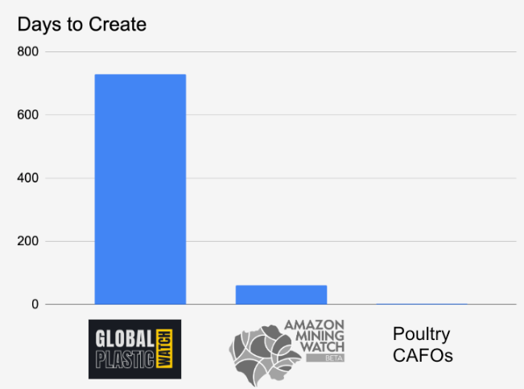
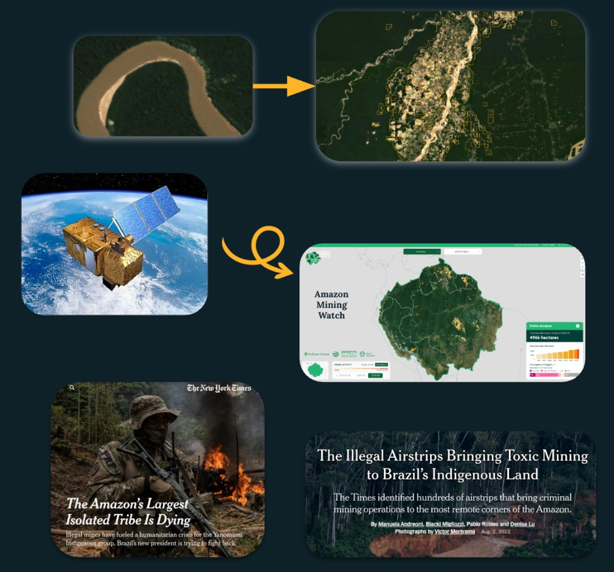
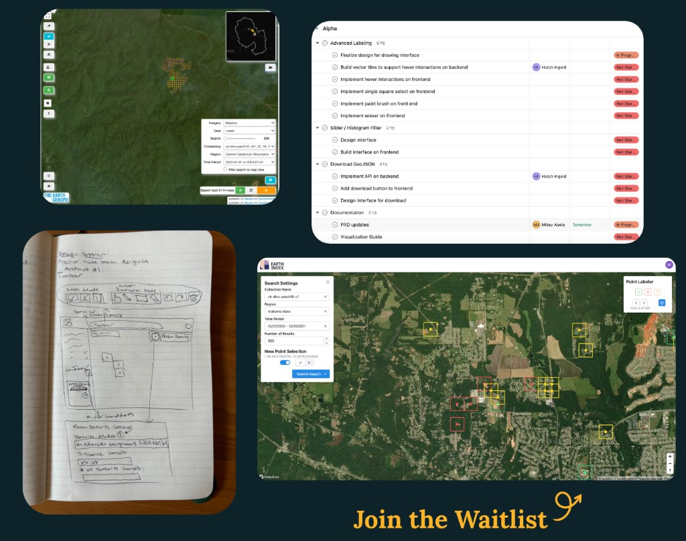
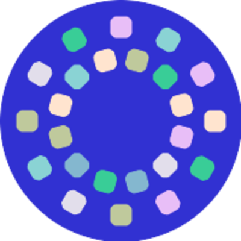
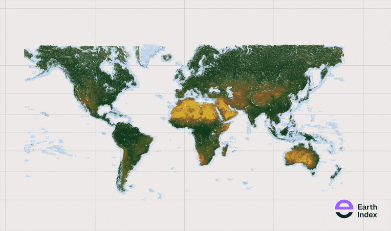
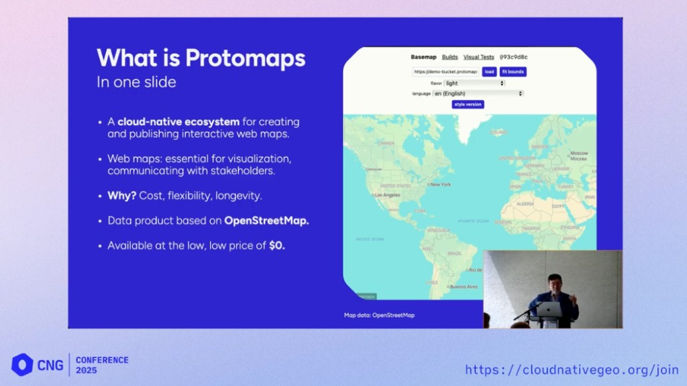
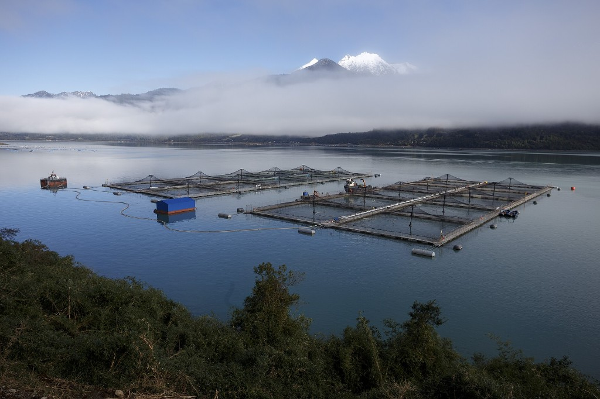
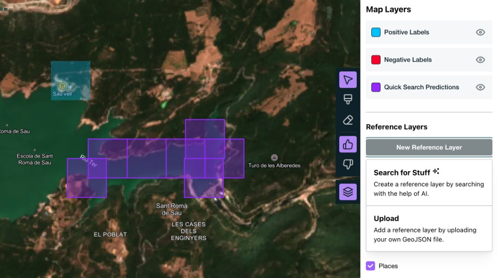
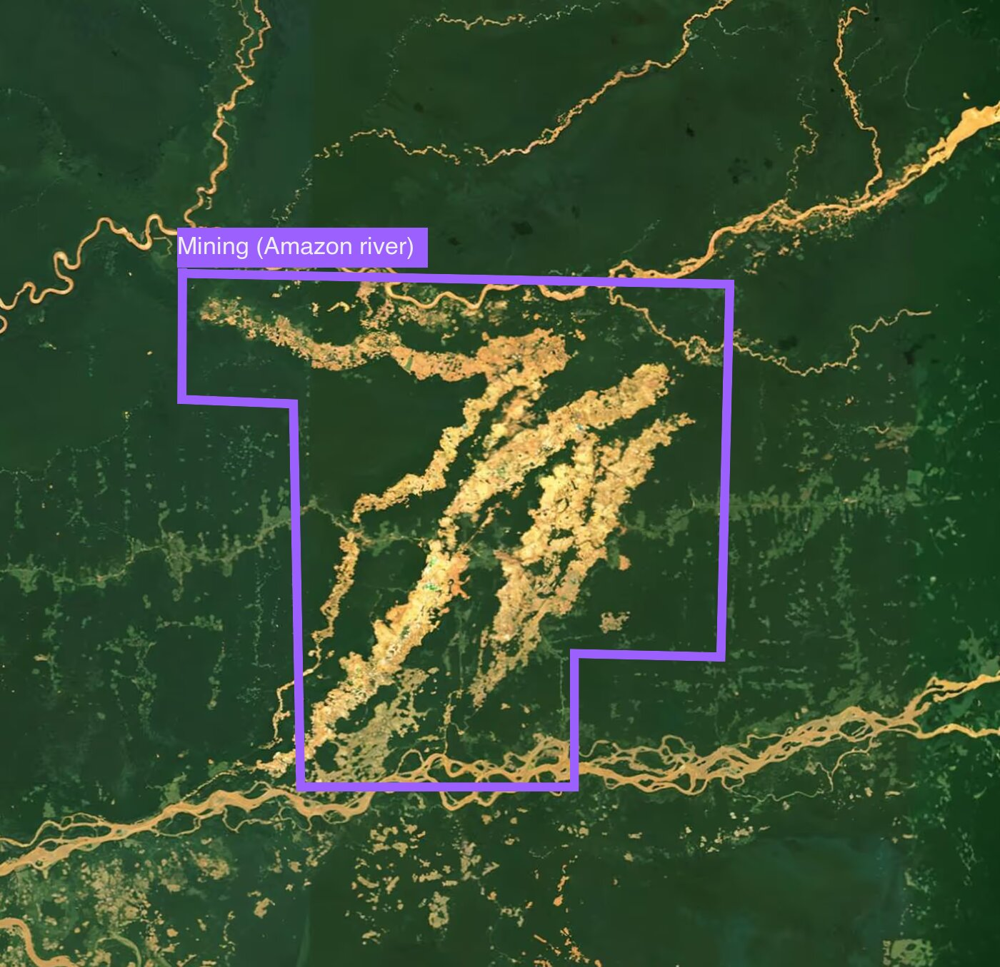

---
resources:
  - custom.scss
  - animations.html
  - preview-reload.html
  - images/cng-logo.svg
title: "From Uploads to Impact"
subtitle: |
  [Improving Discovery with a CNG Default]{.subtitle-tagline}

  [CNG Forum · Thu Oct 8, 2026]{.subtitle-event}
author: "Brad Andrick"
institute: "Earth Genome"
format:
  revealjs:
    theme: [default, custom.scss]
    auto-slide: 15000
    auto-slide-stoppable: false
    slide-number: false
    progress: true
    navigation-mode: linear
    controls: false
    hash: true
    logo: images/eg-logo-light.png
    width: 1600
    height: 900
    chalkboard: false
    include-in-header:
      text: |
        <link rel="preconnect" href="https://fonts.googleapis.com">
        <link rel="preconnect" href="https://fonts.gstatic.com" crossorigin>
        <link rel="stylesheet" href="https://fonts.googleapis.com/css2?family=Geist+Mono:wght@400;700&family=Lora:ital,wght@0,400;0,600;1,400&display=swap">
    include-after-body:
      - animations.html
      - preview-reload.html
title-slide-attributes:
  data-autoslide: "0"
  data-state: no-bars
---

## {#slide-01 background-image="images/bg/01-underwhelmed.avif" background-opacity="0.45"}

::: {.center-v}
[Prepare to Be Underwhelmed]{.big-words}
:::

::: {.notes}
When I started getting this talk together, I realized that it's interesting, but not exciting. And that's what makes it exciting. When CNG formats become the default, the work of this community has indeed borne fruit.
:::


## {#slide-02}

::: {.slide-intro}
::: {.slide-intro-copy}
[Hi, I'm Brad]{.big-words}

[Digital Cartography]{.intro-line}

[UX & UI + Maps]{.intro-line}

[Satellite & GeoAI]{.intro-line}
:::

::: {.slide-intro-photo}
::: {.photo-stack}
{.photo-stack-main}

{.intro-cng-badge fig-alt="Cloud-Native Geospatial"}

```{=html}
<div class="selfie-note">
  <svg class="selfie-arrow" viewBox="0 0 200 170" aria-hidden="true">
    <path d="M28 160 C 50 100, 140 96, 124 132 C 110 162, 58 128, 104 86 C 132 60, 160 44, 188 26" />
    <path d="M168 24 L189 25 L183 46" />
  </svg>
  <span class="selfie-note-text">CNG 2025</span>
</div>
```
:::
:::
:::

::: {.notes}
A little bit about myself: basic background intro.
:::


## {#slide-03 background-image="images/bg/03-earth-genome.png" background-opacity="0.5"}

::: {.center-v}
{.big-logo fig-alt="Earth Genome"}

[Nonprofit = Impact First]{.big-words-sub}
:::

::: {.notes}
Where I work. We are a nonprofit, which means we focus on impact first.
:::


## {#slide-04 background-image="images/bg/04-small-team.jpg" background-opacity="0.4"}

::: {.center-v}
[Small Team.<br>Focused Resources.]{.big-words}
:::

::: {.notes}
A tech nonprofit isn't out there taking venture capital. Our funding comes from grants and contracts, or partnerships, typically with other nonprofits. So where we spend those dollars matters.
:::


## {#slide-05}

::: {.slide-intro .slide-impact}
::: {.slide-intro-copy}
::: {.impact-headline}
[Time]{.impact-line}

[to]{.impact-line}

[Impact]{.impact-line .impact-accent}
:::
:::

::: {.slide-intro-photo}
{.impact-chart}
:::
:::

::: {.notes}
Any tools, decisions, technologies, etc. that save us time and money are things we care about.
:::


## {#slide-06}

::: {.slide-intro .slide-impact}
::: {.slide-intro-photo}
::: {.slide-06-title}
Find Mining
:::

{.impact-chart fig-alt="From river imagery and satellites to Amazon Mining Watch and New York Times coverage"}
:::

::: {.slide-06-divider}
:::

::: {.slide-intro-copy}
::: {.slide-06-title}
Find Anything[\*]{.slide-06-star}
:::

{.how-it-right fig-alt="Earth Index product evolution: maps, tasks, wireframes, and labeling UI"}
:::
:::

::: {.notes}
The basic story of going from early ideas to a real thing people are using today.
:::


## {#slide-07 background-image="images/bg/06-earth-index.jpg" background-opacity="0.55" background-size="cover" background-position="center"}

::: {.center-v}
{.earth-index-logo fig-alt="Earth Index"}

[Label things. Then find more of those things.]{.big-words-sub}
:::

::: {.notes}
What it is: a tool to let users easily label things in satellite imagery, and then find more of those things.
:::


## {#slide-08 background-image="images/bg/08-under-the-hood.jpg" background-opacity="0.4"}

::: {.center-v}
[The CNG Bits<br>Under the Hood]{.big-words}

::: {.logo-grid}
::: {.logo-card}
{fig-alt="GeoParquet"}
[GeoParquet]{.logo-label}
:::

::: {.logo-card}
{fig-alt="Cloud-Native Geospatial Forum"}
:::

::: {.logo-card}
{fig-alt="Source Cooperative"}
:::

::: {.logo-card}
{fig-alt="STAC"}
:::

::: {.logo-card}
{fig-alt="Cloud Optimized GeoTIFF"}
:::

::: {.logo-card}
{fig-alt="PMTiles"}
[PMTiles]{.logo-label}
:::
:::
:::

::: {.notes}
List them…
:::


## {#slide-09}

::: {.slide-cap}
::: {.slide-top}
::: {.headline .embeddings-line}
[3.2 Billion]{.embeddings-stat} Embeddings
:::
:::

::: {.slide-cap-gif}
{.embeddings-gif}
:::
:::

::: {.notes}
To make all this work, we went big on cloud-free imagery and embeddings.
:::


## {#slide-10 background-image="images/bg/10-local-files.jpg" background-opacity="0.45"}

::: {.center-v}
[But Users Have<br>Local Files]{.big-words}
:::

::: {.notes}
But users, the people we made the thing for, have a shapefile or a GeoJSON with existing local data. That is extremely helpful, so they don't have to start from zero.
:::


## {#slide-11 background-image="images/bg/11-the-need.jpg" background-opacity="0.55" background-size="cover" background-position="left center"}

::: {.center-v}
[Draw on Top of<br>What You Already Know]{.big-words}
:::

::: {.notes}
The need: let users upload a reference layer to draw their labels on top of.
:::


## {#slide-12 background-image="images/bg/12-pmtiles.png" background-opacity="0.55" background-size="cover" background-position="right center"}

::: {.center-v}
```{=html}
<div class="flow-words">
  <span class="big-words">Upload</span>
  <span class="flow-loop" aria-hidden="true"><svg viewBox="0 0 40 64"><path d="M36 6 C 4 6, 4 56, 32 56" /><path d="M25 49 L34 56 L25 63" /></svg></span>
  <span class="big-words">PMTiles</span>
  <span class="flow-loop" aria-hidden="true"><svg viewBox="0 0 40 64"><path d="M36 6 C 4 6, 4 56, 32 56" /><path d="M25 49 L34 56 L25 63" /></svg></span>
  <span class="big-words">Done</span>
</div>
```
:::

::: {.notes}
Simply let the user upload the local file, then we convert it to PMTiles, a single file that lives on S3. It's just for reference, so no edits, etc. It's pretty basic. On load, it gets rendered on the map, done. No server, very cheap.
:::


## {#slide-13}

::: {.center-v}
::: {.pmtiles-title}
{.pmtiles-mark fig-alt=""}
[PMTiles]{.big-words}
:::

[A single-file archive format for tiled data, usually used for visualization.]{.pmtiles-def}

[Cloud-Optimized Geospatial Formats Guide]{.pmtiles-source}

[Cheap. Simple. Fast.]{.pmtiles-tagline}
:::

::: {.notes}
Why PMTiles was our choice: cheap, simple, fast, and it fit our straightforward, immutable use case. We end up with a solid reference layer.
:::


## {#slide-14}

::: {.slide-14-thanks}
[Many Thanks, [Brandon Liu]{.hl-name}]{.big-words}

{.slide-14-shot fig-alt="What is Protomaps, CNG Conference 2025"}
:::

::: {.notes}
Protomaps at CNG Conference 2025 — “What is Protomaps” (reference slide).
:::


## {#slide-15 background-image="images/bg/15-saved-time.png" background-opacity="0.45" background-size="cover" background-position="center"}

::: {.center-v}
[Less Plumbing, <br>More [Impact.]{.hl}]{.big-words}
:::

::: {.slide-15-photo-wrap data-pin-right="15"}
{.slide-15-photo fig-alt="Salmon farm pens on a lake in Los Lagos, Chile"}
:::

::: {.notes}
Saved us time and our limited resources. The people in this community (shoutout Brandon) who create this tooling have let our work focus less on plumbing and more on our users.
:::


## {#slide-16}

::: {.slide-cap}
::: {.slide-top}
[Search for Stuff = [PMTiles Again]{.hl}]{.headline}
:::

::: {.slide-frame}

:::
:::

::: {.notes}
Same pattern, just launched. Create reference layers by using the robots to help combine existing OpenStreetMap data. PMTiles still.
:::


## {#slide-17}

::: {.ei-cta}
::: {.ei-cta-copy}
{.ei-cta-logo fig-alt="Earth Index"}

[[Now In Open Access]{.ei-cta-kicker} Sign Up and Find Things]{.ei-cta-title}

[earthgenome.org/earth-index →](https://www.earthgenome.org/earth-index){.ei-cta-button}
:::

::: {.ei-cta-visual}
{.ei-cta-img fig-alt="Earth Index detection outline around mining along an Amazon river"}
:::
:::

::: {.notes}
Open access callout: go sign up, explore embeddings search, and let us know how it works for you.
:::


## {#slide-18}

::: {.center-v}
[Thank You, CNG Community]{.big-words}
:::



::: {.notes}
A thank you to this community. You have had an impact; this is just one example.
:::


## {#slide-19}

::: {.center-v}
[Let's Chat]{.big-words}
:::



::: {.notes}
If you want to chat more, or want to partner with a tech nonprofit on data science and software development, come find me.
:::


## {#slide-20 background-image="images/bg/01-underwhelmed.avif" background-opacity="0.45"}

::: {.center-v}
[What Else Can We Make Underwhelming?]{.big-words}
:::

::: {.notes}
Now what else can we make underwhelming?
:::


## {#slide-applause data-autoslide="0" data-state="no-bars"}

```{=html}
<div class="center-v">
<svg class="clappers" viewBox="0 0 1500 520" aria-label="A crowd of stick figures clapping, with the occasional high-five">
  <g stroke-width="6" stroke-linecap="round" stroke-linejoin="round" fill="none">
    <!-- Back row first so nearer figures draw on top; forearms swing about the elbow -->
    <g class="drift" style="--dx:3.1px; --dy:0.1px; --dp:3.48s; --dd:-2.38s">
    <svg class="clapper" x="75" y="-6" width="140" height="210" viewBox="0 0 200 300" style="--d:0.27s; --t:0.27s" stroke="#7f888b">
      <line x1="100" y1="88" x2="100" y2="190"/>
      <polyline points="65,270 100,190 135,270"/>
      <g class="side side-l"><line x1="100" y1="105" x2="50" y2="160"/><line class="forearm forearm-l" style="transform-origin:50px 160px" x1="50" y1="160" x2="96" y2="140"/></g>
      <g class="side side-r"><line x1="100" y1="105" x2="150" y2="160"/><line class="forearm forearm-r" style="transform-origin:150px 160px" x1="150" y1="160" x2="104" y2="140"/></g>
      <circle cx="100" cy="60" r="28" fill="#0e2129"/>
      <g class="spark" stroke="#ffc000" stroke-width="4">
        <line x1="90" y1="132" x2="81" y2="132"/><line x1="110" y1="132" x2="119" y2="132"/>
      </g>
    </svg>
    </g>
    <g class="drift" style="--dx:2.0px; --dy:1.0px; --dp:3.08s; --dd:-2.33s">
    <svg class="clapper" x="267" y="1" width="140" height="210" viewBox="0 0 200 300" style="--d:0.55s; --t:0.26s" stroke="#7f888b">
      <line x1="100" y1="88" x2="100" y2="190"/>
      <polyline points="65,270 100,190 135,270"/>
      <g class="side side-l"><line x1="100" y1="105" x2="50" y2="160"/><line class="forearm forearm-l" style="transform-origin:50px 160px" x1="50" y1="160" x2="96" y2="140"/></g>
      <g class="side side-r"><line x1="100" y1="105" x2="150" y2="160"/><line class="forearm forearm-r" style="transform-origin:150px 160px" x1="150" y1="160" x2="104" y2="140"/></g>
      <circle cx="100" cy="60" r="28" fill="#0e2129"/>
      <g class="spark" stroke="#ffc000" stroke-width="4">
        <line x1="90" y1="132" x2="81" y2="132"/><line x1="110" y1="132" x2="119" y2="132"/>
      </g>
    </svg>
    </g>
    <g class="drift" style="--dx:2.9px; --dy:1.6px; --dp:4.16s; --dd:-0.57s">
    <g class="walker" style="--hf:4.37s; --hfd:1.55s; --w:56px">
    <svg class="clapper" x="467" y="0" width="140" height="210" viewBox="0 0 200 300" style="--d:0.30s; --t:0.27s" stroke="#7f888b">
      <line x1="100" y1="88" x2="100" y2="190"/>
      <polyline points="65,270 100,190 135,270"/>
      <g class="side side-l"><line x1="100" y1="105" x2="50" y2="160"/><line class="forearm forearm-l" style="transform-origin:50px 160px" x1="50" y1="160" x2="96" y2="140"/></g>
      <g class="side side-r hf-hide"><line x1="100" y1="105" x2="150" y2="160"/><line class="forearm forearm-r" style="transform-origin:150px 160px" x1="150" y1="160" x2="104" y2="140"/></g>
      <line class="hf-arm hf-arm-r" style="transform-origin:100px 105px" x1="100" y1="105" x2="190" y2="105"/>
      <circle cx="100" cy="60" r="28" fill="#0e2129"/>
      <g class="spark" stroke="#ffc000" stroke-width="4">
        <line x1="90" y1="132" x2="81" y2="132"/><line x1="110" y1="132" x2="119" y2="132"/>
      </g>
    </svg>
    </g>
    </g>
    <g class="drift" style="--dx:2.9px; --dy:1.6px; --dp:4.16s; --dd:-0.57s">
    <g class="walker" style="--hf:4.37s; --hfd:1.55s; --w:-56px">
    <svg class="clapper" x="678" y="-7" width="140" height="210" viewBox="0 0 200 300" style="--d:0.11s; --t:0.26s" stroke="#7f888b">
      <line x1="100" y1="88" x2="100" y2="190"/>
      <polyline points="65,270 100,190 135,270"/>
      <g class="side side-l hf-hide"><line x1="100" y1="105" x2="50" y2="160"/><line class="forearm forearm-l" style="transform-origin:50px 160px" x1="50" y1="160" x2="96" y2="140"/></g>
      <g class="side side-r"><line x1="100" y1="105" x2="150" y2="160"/><line class="forearm forearm-r" style="transform-origin:150px 160px" x1="150" y1="160" x2="104" y2="140"/></g>
      <line class="hf-arm hf-arm-l" style="transform-origin:100px 105px" x1="100" y1="105" x2="10" y2="105"/>
      <circle cx="100" cy="60" r="28" fill="#0e2129"/>
      <g class="spark" stroke="#ffc000" stroke-width="4">
        <line x1="90" y1="132" x2="81" y2="132"/><line x1="110" y1="132" x2="119" y2="132"/>
      </g>
    </svg>
    </g>
    </g>
    <g class="drift" style="--dx:2.4px; --dy:0.6px; --dp:4.85s; --dd:-1.95s">
    <svg class="clapper" x="878" y="5" width="140" height="210" viewBox="0 0 200 300" style="--d:0.38s; --t:0.30s" stroke="#7f888b">
      <line x1="100" y1="88" x2="100" y2="190"/>
      <polyline points="65,270 100,190 135,270"/>
      <g class="side side-l"><line x1="100" y1="105" x2="50" y2="160"/><line class="forearm forearm-l" style="transform-origin:50px 160px" x1="50" y1="160" x2="96" y2="140"/></g>
      <g class="side side-r"><line x1="100" y1="105" x2="150" y2="160"/><line class="forearm forearm-r" style="transform-origin:150px 160px" x1="150" y1="160" x2="104" y2="140"/></g>
      <circle cx="100" cy="60" r="28" fill="#0e2129"/>
      <g class="spark" stroke="#ffc000" stroke-width="4">
        <line x1="90" y1="132" x2="81" y2="132"/><line x1="110" y1="132" x2="119" y2="132"/>
      </g>
    </svg>
    </g>
    <g class="drift" style="--dx:1.2px; --dy:1.4px; --dp:3.41s; --dd:-3.26s">
    <svg class="clapper" x="1072" y="2" width="140" height="210" viewBox="0 0 200 300" style="--d:0.06s; --t:0.24s" stroke="#7f888b">
      <line x1="100" y1="88" x2="100" y2="190"/>
      <polyline points="65,270 100,190 135,270"/>
      <g class="side side-l"><line x1="100" y1="105" x2="50" y2="160"/><line class="forearm forearm-l" style="transform-origin:50px 160px" x1="50" y1="160" x2="96" y2="140"/></g>
      <g class="side side-r"><line x1="100" y1="105" x2="150" y2="160"/><line class="forearm forearm-r" style="transform-origin:150px 160px" x1="150" y1="160" x2="104" y2="140"/></g>
      <circle cx="100" cy="60" r="28" fill="#0e2129"/>
      <g class="spark" stroke="#ffc000" stroke-width="4">
        <line x1="90" y1="132" x2="81" y2="132"/><line x1="110" y1="132" x2="119" y2="132"/>
      </g>
    </svg>
    </g>
    <g class="drift" style="--dx:0.8px; --dy:1.3px; --dp:3.96s; --dd:-2.17s">
    <svg class="clapper" x="1282" y="-2" width="140" height="210" viewBox="0 0 200 300" style="--d:0.05s; --t:0.30s" stroke="#7f888b">
      <line x1="100" y1="88" x2="100" y2="190"/>
      <polyline points="65,270 100,190 135,270"/>
      <g class="side side-l"><line x1="100" y1="105" x2="50" y2="160"/><line class="forearm forearm-l" style="transform-origin:50px 160px" x1="50" y1="160" x2="96" y2="140"/></g>
      <g class="side side-r"><line x1="100" y1="105" x2="150" y2="160"/><line class="forearm forearm-r" style="transform-origin:150px 160px" x1="150" y1="160" x2="104" y2="140"/></g>
      <circle cx="100" cy="60" r="28" fill="#0e2129"/>
      <g class="spark" stroke="#ffc000" stroke-width="4">
        <line x1="90" y1="132" x2="81" y2="132"/><line x1="110" y1="132" x2="119" y2="132"/>
      </g>
    </svg>
    </g>
    <g class="drift" style="--dx:6.0px; --dy:-0.7px; --dp:3.39s; --dd:-0.69s">
    <svg class="clapper" x="114" y="101" width="170" height="255" viewBox="0 0 200 300" style="--d:0.42s; --t:0.21s" stroke="#c2c5c5">
      <line x1="100" y1="88" x2="100" y2="190"/>
      <polyline points="65,270 100,190 135,270"/>
      <g class="side side-l"><line x1="100" y1="105" x2="50" y2="160"/><line class="forearm forearm-l" style="transform-origin:50px 160px" x1="50" y1="160" x2="96" y2="140"/></g>
      <g class="side side-r"><line x1="100" y1="105" x2="150" y2="160"/><line class="forearm forearm-r" style="transform-origin:150px 160px" x1="150" y1="160" x2="104" y2="140"/></g>
      <circle cx="100" cy="60" r="28" fill="#0e2129"/>
      <g class="spark" stroke="#ffc000" stroke-width="4">
        <line x1="90" y1="132" x2="81" y2="132"/><line x1="110" y1="132" x2="119" y2="132"/>
      </g>
    </svg>
    </g>
    <g class="drift" style="--dx:3.5px; --dy:-2.3px; --dp:2.58s; --dd:-1.89s">
    <g class="walker" style="--hf:1.55s; --hfd:1.98s; --w:58px">
    <svg class="clapper" x="332" y="89" width="170" height="255" viewBox="0 0 200 300" style="--d:0.59s; --t:0.32s" stroke="#c2c5c5">
      <line x1="100" y1="88" x2="100" y2="190"/>
      <polyline points="65,270 100,190 135,270"/>
      <g class="side side-l"><line x1="100" y1="105" x2="50" y2="160"/><line class="forearm forearm-l" style="transform-origin:50px 160px" x1="50" y1="160" x2="96" y2="140"/></g>
      <g class="side side-r hf-hide"><line x1="100" y1="105" x2="150" y2="160"/><line class="forearm forearm-r" style="transform-origin:150px 160px" x1="150" y1="160" x2="104" y2="140"/></g>
      <line class="hf-arm hf-arm-r" style="transform-origin:100px 105px" x1="100" y1="105" x2="190" y2="105"/>
      <circle cx="100" cy="60" r="28" fill="#0e2129"/>
      <g class="spark" stroke="#ffc000" stroke-width="4">
        <line x1="90" y1="132" x2="81" y2="132"/><line x1="110" y1="132" x2="119" y2="132"/>
      </g>
    </svg>
    </g>
    </g>
    <g class="drift" style="--dx:3.5px; --dy:-2.3px; --dp:2.58s; --dd:-1.89s">
    <g class="walker" style="--hf:1.55s; --hfd:1.98s; --w:-58px">
    <svg class="clapper" x="567" y="90" width="170" height="255" viewBox="0 0 200 300" style="--d:0.39s; --t:0.27s" stroke="#c2c5c5">
      <line x1="100" y1="88" x2="100" y2="190"/>
      <polyline points="65,270 100,190 135,270"/>
      <g class="side side-l hf-hide"><line x1="100" y1="105" x2="50" y2="160"/><line class="forearm forearm-l" style="transform-origin:50px 160px" x1="50" y1="160" x2="96" y2="140"/></g>
      <g class="side side-r"><line x1="100" y1="105" x2="150" y2="160"/><line class="forearm forearm-r" style="transform-origin:150px 160px" x1="150" y1="160" x2="104" y2="140"/></g>
      <line class="hf-arm hf-arm-l" style="transform-origin:100px 105px" x1="100" y1="105" x2="10" y2="105"/>
      <circle cx="100" cy="60" r="28" fill="#0e2129"/>
      <g class="spark" stroke="#ffc000" stroke-width="4">
        <line x1="90" y1="132" x2="81" y2="132"/><line x1="110" y1="132" x2="119" y2="132"/>
      </g>
    </svg>
    </g>
    </g>
    <g class="drift" style="--dx:-0.5px; --dy:-1.6px; --dp:4.10s; --dd:-0.90s">
    <g class="walker" style="--hf:8.62s; --hfd:1.56s; --w:39px">
    <svg class="clapper" x="777" y="93" width="170" height="255" viewBox="0 0 200 300" style="--d:0.09s; --t:0.20s" stroke="#c2c5c5">
      <line x1="100" y1="88" x2="100" y2="190"/>
      <polyline points="65,270 100,190 135,270"/>
      <g class="side side-l"><line x1="100" y1="105" x2="50" y2="160"/><line class="forearm forearm-l" style="transform-origin:50px 160px" x1="50" y1="160" x2="96" y2="140"/></g>
      <g class="side side-r hf-hide"><line x1="100" y1="105" x2="150" y2="160"/><line class="forearm forearm-r" style="transform-origin:150px 160px" x1="150" y1="160" x2="104" y2="140"/></g>
      <line class="hf-arm hf-arm-r" style="transform-origin:100px 105px" x1="100" y1="105" x2="190" y2="105"/>
      <circle cx="100" cy="60" r="28" fill="#0e2129"/>
      <g class="spark" stroke="#ffc000" stroke-width="4">
        <line x1="90" y1="132" x2="81" y2="132"/><line x1="110" y1="132" x2="119" y2="132"/>
      </g>
    </svg>
    </g>
    </g>
    <g class="drift" style="--dx:-0.5px; --dy:-1.6px; --dp:4.10s; --dd:-0.90s">
    <g class="walker" style="--hf:8.62s; --hfd:1.56s; --w:-39px">
    <svg class="clapper" x="974" y="88" width="170" height="255" viewBox="0 0 200 300" style="--d:0.32s; --t:0.21s" stroke="#c2c5c5">
      <line x1="100" y1="88" x2="100" y2="190"/>
      <polyline points="65,270 100,190 135,270"/>
      <g class="side side-l hf-hide"><line x1="100" y1="105" x2="50" y2="160"/><line class="forearm forearm-l" style="transform-origin:50px 160px" x1="50" y1="160" x2="96" y2="140"/></g>
      <g class="side side-r"><line x1="100" y1="105" x2="150" y2="160"/><line class="forearm forearm-r" style="transform-origin:150px 160px" x1="150" y1="160" x2="104" y2="140"/></g>
      <line class="hf-arm hf-arm-l" style="transform-origin:100px 105px" x1="100" y1="105" x2="10" y2="105"/>
      <circle cx="100" cy="60" r="28" fill="#0e2129"/>
      <g class="spark" stroke="#ffc000" stroke-width="4">
        <line x1="90" y1="132" x2="81" y2="132"/><line x1="110" y1="132" x2="119" y2="132"/>
      </g>
    </svg>
    </g>
    </g>
    <g class="drift" style="--dx:-3.8px; --dy:-2.0px; --dp:4.90s; --dd:-4.79s">
    <svg class="clapper" x="1208" y="94" width="170" height="255" viewBox="0 0 200 300" style="--d:0.11s; --t:0.23s" stroke="#c2c5c5">
      <line x1="100" y1="88" x2="100" y2="190"/>
      <polyline points="65,270 100,190 135,270"/>
      <g class="side side-l"><line x1="100" y1="105" x2="50" y2="160"/><line class="forearm forearm-l" style="transform-origin:50px 160px" x1="50" y1="160" x2="96" y2="140"/></g>
      <g class="side side-r"><line x1="100" y1="105" x2="150" y2="160"/><line class="forearm forearm-r" style="transform-origin:150px 160px" x1="150" y1="160" x2="104" y2="140"/></g>
      <circle cx="100" cy="60" r="28" fill="#0e2129"/>
      <g class="spark" stroke="#ffc000" stroke-width="4">
        <line x1="90" y1="132" x2="81" y2="132"/><line x1="110" y1="132" x2="119" y2="132"/>
      </g>
    </svg>
    </g>
    <g class="drift" style="--dx:7.2px; --dy:-0.1px; --dp:3.27s; --dd:-0.58s">
    <g class="walker" style="--hf:7.54s; --hfd:1.83s; --w:58px">
    <svg class="clapper" x="153" y="199" width="200" height="300" viewBox="0 0 200 300" style="--d:0.02s; --t:0.26s" stroke="#fafafa">
      <line x1="100" y1="88" x2="100" y2="190"/>
      <polyline points="65,270 100,190 135,270"/>
      <g class="side side-l"><line x1="100" y1="105" x2="50" y2="160"/><line class="forearm forearm-l" style="transform-origin:50px 160px" x1="50" y1="160" x2="96" y2="140"/></g>
      <g class="side side-r hf-hide"><line x1="100" y1="105" x2="150" y2="160"/><line class="forearm forearm-r" style="transform-origin:150px 160px" x1="150" y1="160" x2="104" y2="140"/></g>
      <line class="hf-arm hf-arm-r" style="transform-origin:100px 105px" x1="100" y1="105" x2="190" y2="105"/>
      <circle cx="100" cy="60" r="28" fill="#0e2129"/>
      <g class="spark" stroke="#ffc000" stroke-width="4">
        <line x1="90" y1="132" x2="81" y2="132"/><line x1="110" y1="132" x2="119" y2="132"/>
      </g>
    </svg>
    </g>
    </g>
    <g class="drift" style="--dx:7.2px; --dy:-0.1px; --dp:3.27s; --dd:-0.58s">
    <g class="walker" style="--hf:7.54s; --hfd:1.83s; --w:-58px">
    <svg class="clapper" x="409" y="203" width="200" height="300" viewBox="0 0 200 300" style="--d:0.26s; --t:0.30s" stroke="#fafafa">
      <line x1="100" y1="88" x2="100" y2="190"/>
      <polyline points="65,270 100,190 135,270"/>
      <g class="side side-l hf-hide"><line x1="100" y1="105" x2="50" y2="160"/><line class="forearm forearm-l" style="transform-origin:50px 160px" x1="50" y1="160" x2="96" y2="140"/></g>
      <g class="side side-r"><line x1="100" y1="105" x2="150" y2="160"/><line class="forearm forearm-r" style="transform-origin:150px 160px" x1="150" y1="160" x2="104" y2="140"/></g>
      <line class="hf-arm hf-arm-l" style="transform-origin:100px 105px" x1="100" y1="105" x2="10" y2="105"/>
      <circle cx="100" cy="60" r="28" fill="#0e2129"/>
      <g class="spark" stroke="#ffc000" stroke-width="4">
        <line x1="90" y1="132" x2="81" y2="132"/><line x1="110" y1="132" x2="119" y2="132"/>
      </g>
    </svg>
    </g>
    </g>
    <g class="drift" style="--dx:2.7px; --dy:2.9px; --dp:4.00s; --dd:-2.78s">
    <svg class="clapper" x="652" y="200" width="200" height="300" viewBox="0 0 200 300" style="--d:0.31s; --t:0.28s" stroke="#fafafa">
      <line x1="100" y1="88" x2="100" y2="190"/>
      <polyline points="65,270 100,190 135,270"/>
      <g class="side side-l"><line x1="100" y1="105" x2="50" y2="160"/><line class="forearm forearm-l" style="transform-origin:50px 160px" x1="50" y1="160" x2="96" y2="140"/></g>
      <g class="side side-r"><line x1="100" y1="105" x2="150" y2="160"/><line class="forearm forearm-r" style="transform-origin:150px 160px" x1="150" y1="160" x2="104" y2="140"/></g>
      <circle cx="100" cy="60" r="28" fill="#0e2129"/>
      <g class="spark" stroke="#ffc000" stroke-width="4">
        <line x1="90" y1="132" x2="81" y2="132"/><line x1="110" y1="132" x2="119" y2="132"/>
      </g>
    </svg>
    </g>
    <g class="drift" style="--dx:4.6px; --dy:1.3px; --dp:4.78s; --dd:-3.10s">
    <svg class="clapper" x="907" y="197" width="200" height="300" viewBox="0 0 200 300" style="--d:0.30s; --t:0.28s" stroke="#fafafa">
      <line x1="100" y1="88" x2="100" y2="190"/>
      <polyline points="65,270 100,190 135,270"/>
      <g class="side side-l"><line x1="100" y1="105" x2="50" y2="160"/><line class="forearm forearm-l" style="transform-origin:50px 160px" x1="50" y1="160" x2="96" y2="140"/></g>
      <g class="side side-r"><line x1="100" y1="105" x2="150" y2="160"/><line class="forearm forearm-r" style="transform-origin:150px 160px" x1="150" y1="160" x2="104" y2="140"/></g>
      <circle cx="100" cy="60" r="28" fill="#0e2129"/>
      <g class="spark" stroke="#ffc000" stroke-width="4">
        <line x1="90" y1="132" x2="81" y2="132"/><line x1="110" y1="132" x2="119" y2="132"/>
      </g>
    </svg>
    </g>
    <g class="drift" style="--dx:4.8px; --dy:-0.1px; --dp:3.64s; --dd:-2.91s">
    <svg class="clapper" x="1139" y="199" width="200" height="300" viewBox="0 0 200 300" style="--d:0.27s; --t:0.23s" stroke="#fafafa">
      <line x1="100" y1="88" x2="100" y2="190"/>
      <polyline points="65,270 100,190 135,270"/>
      <g class="side side-l"><line x1="100" y1="105" x2="50" y2="160"/><line class="forearm forearm-l" style="transform-origin:50px 160px" x1="50" y1="160" x2="96" y2="140"/></g>
      <g class="side side-r"><line x1="100" y1="105" x2="150" y2="160"/><line class="forearm forearm-r" style="transform-origin:150px 160px" x1="150" y1="160" x2="104" y2="140"/></g>
      <circle cx="100" cy="60" r="28" fill="#0e2129"/>
      <g class="spark" stroke="#ffc000" stroke-width="4">
        <line x1="90" y1="132" x2="81" y2="132"/><line x1="110" y1="132" x2="119" y2="132"/>
      </g>
    </svg>
    </g>
    <g class="hf-spark" style="--hf:1.55s; --hfd:1.98s" transform="translate(534 129)" stroke="#ffc000" stroke-width="4"><line x1="-7.4" y1="-4.2" x2="-17.7" y2="-10.2"/><line x1="-3.6" y1="-7.7" x2="-8.6" y2="-18.5"/><line x1="0.0" y1="-8.5" x2="0.0" y2="-20.4"/><line x1="3.6" y1="-7.7" x2="8.6" y2="-18.5"/><line x1="7.4" y1="-4.2" x2="17.7" y2="-10.2"/></g>
    <g class="hf-spark" style="--hf:4.37s; --hfd:1.55s" transform="translate(642 30)" stroke="#ffc000" stroke-width="4"><line x1="-6.1" y1="-3.5" x2="-14.5" y2="-8.4"/><line x1="-3.0" y1="-6.3" x2="-7.1" y2="-15.2"/><line x1="0.0" y1="-7.0" x2="0.0" y2="-16.8"/><line x1="3.0" y1="-6.3" x2="7.1" y2="-15.2"/><line x1="6.1" y1="-3.5" x2="14.5" y2="-8.4"/></g>
    <g class="hf-spark" style="--hf:7.54s; --hfd:1.83s" transform="translate(381 248)" stroke="#ffc000" stroke-width="4"><line x1="-8.7" y1="-5.0" x2="-20.8" y2="-12.0"/><line x1="-4.2" y1="-9.1" x2="-10.1" y2="-21.8"/><line x1="0.0" y1="-10.0" x2="0.0" y2="-24.0"/><line x1="4.2" y1="-9.1" x2="10.1" y2="-21.8"/><line x1="8.7" y1="-5.0" x2="20.8" y2="-12.0"/></g>
    <g class="hf-spark" style="--hf:8.62s; --hfd:1.56s" transform="translate(961 131)" stroke="#ffc000" stroke-width="4"><line x1="-7.4" y1="-4.2" x2="-17.7" y2="-10.2"/><line x1="-3.6" y1="-7.7" x2="-8.6" y2="-18.5"/><line x1="0.0" y1="-8.5" x2="0.0" y2="-20.4"/><line x1="3.6" y1="-7.7" x2="8.6" y2="-18.5"/><line x1="7.4" y1="-4.2" x2="17.7" y2="-10.2"/></g>
  </g>
</svg>
<p class="applause-label">(applause time!)</p>
</div>
```

```{=html}
<script>
// Move the title slide's howto box (authored above the first ##) onto the title slide.
// Runs immediately, before RevealJS initializes, so the empty slide it leaves never counts.
(function () {
  var th = document.getElementById('title-howto');
  var ts = document.getElementById('title-slide');
  if (!th || !ts) return;
  var emptySlide = th.closest('section');
  ts.appendChild(th);
  emptySlide.remove();
})();

document.addEventListener('DOMContentLoaded', function () {
  // Give the title slide a clean URL hash (#/slide-title instead of #/title-slide)
  var ts = document.getElementById('title-slide');
  if (ts) ts.id = 'slide-title';

  function setupTitleAffiliationLogo() {
    var slide = document.getElementById('slide-title') || document.getElementById('title-slide');
    if (!slide) return;
    var author = slide.querySelector('.quarto-title-author');
    if (author && !author.querySelector('.title-author-role')) {
      var aff = author.querySelector('.quarto-title-affiliation');
      var role = document.createElement('p');
      role.className = 'title-author-role';
      role.textContent = 'Software Engineering Lead @';
      if (aff) author.insertBefore(role, aff);
      else author.appendChild(role);
    }
    var aff = slide.querySelector('.quarto-title-affiliation');
    if (!aff || aff.querySelector('img.title-eg-logo')) return;
    aff.textContent = '';
    var img = document.createElement('img');
    img.src = 'images/eg-logo-light.png';
    img.alt = 'Earth Genome';
    img.className = 'title-eg-logo';
    aff.appendChild(img);
  }
  setupTitleAffiliationLogo();

  // Bottom-right: large slide number (slide-01 … slide-20) + CNG logo
  var chrome = document.createElement('div');
  chrome.id = 'deck-chrome';
  chrome.setAttribute('aria-hidden', 'true');
  chrome.innerHTML =
    '<span id="deck-slide-num"></span>' +
    '';
  document.querySelector('.reveal').appendChild(chrome);
  var numEl = document.getElementById('deck-slide-num');

  function updateDeckChrome() {
    var slide = Reveal.getCurrentSlide();
    var id = slide && slide.id;
    var m = id && id.match(/^slide-(\d+)$/);
    var isTitle = id === 'slide-title' || id === 'title-slide';
    var isApplause = id === 'slide-applause';

    chrome.classList.remove('is-visible', 'logo-only');
    if (isApplause) return;

    if (m) {
      numEl.textContent = String(parseInt(m[1], 10));
      chrome.classList.add('is-visible');
    } else if (isTitle) {
      numEl.textContent = '';
      chrome.classList.add('is-visible', 'logo-only');
    }
  }

  // Countdown bar: sits above the RevealJS progress bar, runs right-to-left per slide.
  // Only shown while auto-advance is on (e.g. not with ?autoSlide=0), so it never
  // counts down to a slide change that won't happen.
  function resetCountdown() {
    var fill = document.getElementById('slide-countdown-fill');
    fill.style.animation = 'none';
    fill.offsetHeight; // force reflow
    fill.style.animation = '';
  }

  function startCountdown() {
    if (!Reveal.getConfig().autoSlide) return;
    var cdBar = document.createElement('div');
    cdBar.id = 'slide-countdown';
    cdBar.innerHTML = '<div id="slide-countdown-fill"></div>';
    document.querySelector('.reveal').appendChild(cdBar);
    resetCountdown();
    Reveal.on('slidechanged', resetCountdown);
  }

  function onRevealReady() {
    startCountdown();
    updateDeckChrome();
    Reveal.on('slidechanged', updateDeckChrome);
  }

  // Reveal may already be ready by now; if so its 'ready' event has been missed
  if (Reveal.isReady()) onRevealReady();
  else Reveal.on('ready', onRevealReady);
});
</script>
```
